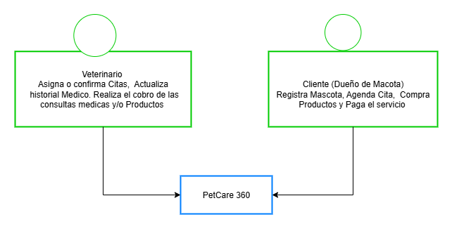
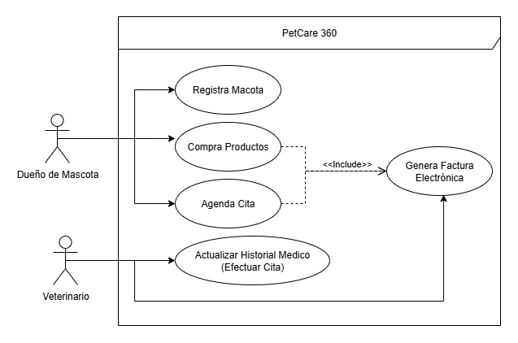
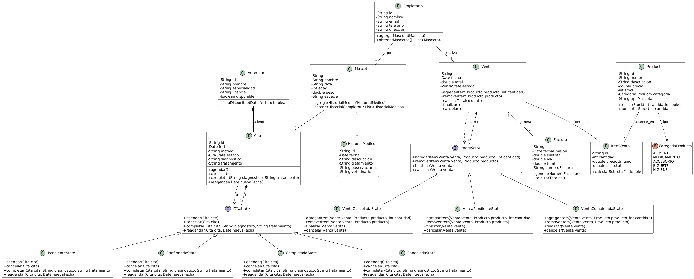

# DOSW_REFUERZO
#### Autor:
- Ana Gabriela Fiqutiva Poveda
---
### Enunciado:
- La empresa PetCare 360 quiere modernizar la manera en que las veterinarias gestionan sus servicios y la relación con
los clientes. Buscan una plataforma que permita:
1.  Registrar mascotas con sus características (raza, edad, historial médico).
2.	Agendar citas médicas y asignar veterinarios.
3.	Vender productos de cuidado animal (alimentos, medicamentos, accesorios).
4.  Generar facturación electrónica para cada servicio o compra.
- Su reto es diseñar, construir e implementar la primera versión del sistema, siguiendo buenas prácticas de ingeniería 
de software, aplicando patrones de diseño, principios SOLID, pruebas y diagramación.
---
# Desarrollo:
##  Tecnologías Utilizadas

- **Backend**: Spring Boot 
- **Gestión de Dependencias**: Maven
- **Pruebas**: JUnit 5
- **Cobertura**: JaCoCo
- **Calidad de Código**: SonarQube
- **Documentación API**: Swagger UI 

##  Instrucciones de Configuración y Desarrollo
1. Clonar el repositorio:
```bash
git clone https://github.com/AnaFiquitiva/DOSW_REFUERZO.git 
cd DOSW_REFUERZO
```
2. Ejecutar el proyecto:
```bash
mvn clean install
mvnw spring-boot:run
```
3. Acceder a la documentación de la API:

4. Ejecutar pruebas y cobertura:
```bash
mvn test
mvn jacoco:report
# Reporte en: target/site/jacoco/index.html
```
5. Análisis de calidad con SonarQube:
Configurar SonarQube y ejecutar análisis
```bash
mvn sonar:sonar
mvn sonar:sonar -Dsonar.login=TU_TOKEN
```
---
# Semana 1:
## 1. Scaffolding del Proyecto:
- Se realizó el scaffolding del proyecto con Spring Boot y gestión con Maven.


## 2. Dependencias:
- Se Agregaron las siguientes dependencias al archivo `pom.xml`:
1. JUNIT: Para pruebas unitarias.
    ```xml
    <!-- JUnit para pruebas unitarias -->
    <dependency>
        <groupId>org.junit.jupiter</groupId>
        <artifactId>junit-jupiter-engine</artifactId>
        <version>5.8.1</version>
        <scope>test</scope>
    </dependency>
    ```
2. JACOCO: Para medir la cobertura de pruebas.
    ```xml

    <!-- JaCoCo para cobertura de pruebas -->
    <dependency>
        <groupId>org.jacoco</groupId>
        <artifactId>jacoco-maven-plugin</artifactId>
        <version>0.8.10</version>
    </dependency>
    ```
3. SONARQUEBE: Para análisis de calidad de código.
    ```xml
    <!-- SonarQube -->
    <dependency>
        <groupId>org.sonarsource.scanner.maven</groupId>
        <artifactId>sonar-maven-plugin</artifactId>
        <version>3.9.1.2184</version>
    </dependency>
    ```
   4. LOMBOK: Para reducir el código boilerplate.
   ```xml
    <!-- Lombok -->
    <dependency>
        <groupId>org.projectlombok</groupId>
        <artifactId>lombok</artifactId>
        <optional>true</optional>
      </dependency>
   ```
5. SWAGGER UI: Para documentación de la API.
    ```xml
      <!-- Swagger UI -->
      <dependency>
        <groupId>org.springdoc</groupId>
        <artifactId>springdoc-openapi-starter-webmvc-ui</artifactId>
        <version>2.2.0</version>
      </dependency>
    ```
### 3. Estrategia de Ramas GITFLOW y Commits:
1. Definir la estrategia de ramas en Git:
- `main`: Código base.
- `develop`: Desarrollo del ejercicio.
- `feature/nombre`: Implementación de nuevas funcionalidades.
- `release/nombre`: Preparación para lanzamiento.
- `hotfix/nombre`: Corrección de errores .
2. Definir Commits:
- Feat: Nueva funcionalidad.
- Fix: Corrección de errores.
- Docs: Documentación.
- Style: Cambios de formato y estilo.
- Refactor: Refactorización de código.
- Test: Pruebas.

### 4. Diagramación Inicial:
- Crear diagramas UML iniciales:
#### 1. Diagrama de Contexto.


##### Explicación:
- El Diagrama de Contexto muestra la interacción entre el sistema PetCare 360 y sus actores principales: Clientes y Veterinarios . 
  - Los clientes pueden registrar mascotas, agendar citas y comprar productos. 
  - Los veterinarios gestionan las citas médicas, el historial de las mascotas y realiza el cobro del servicio o productos.


##### Explicación:  
- El Diagrama de Casos de Uso ilustra las principales funcionalidades del sistema PetCare 360 y cómo los actores interactúan con ellas. 
  - Los clientes pueden registrar mascotas, agendar citas y comprar productos. 
  - Los veterinarios pueden gestionar citas médicas y el historial médico de las mascotas. 

3. Diagrama de Clases Preliminar.


##### Explicación:


El diagrama de clases representa la estructura completa del sistema **PetCare 360**, mostrando las entidades principales del dominio, sus atributos, métodos y las relaciones entre ellas.  
El diseño sigue una arquitectura orientada a objetos que facilita la mantenibilidad y escalabilidad del sistema.


##  Entidades Principales

###  Propietario (Owner)
Representa al dueño de las mascotas registradas en el sistema. Gestiona la información de contacto y mantiene la lista de sus mascotas.

**Relaciones:**
- Posee múltiples Mascotas (1:*)
- Realiza múltiples Ventas (1:*)

---

###  Mascota (Pet)
Entidad central que representa a los animales atendidos en la veterinaria. Contiene información básica como nombre, raza, edad, peso y especie.

**Relaciones:**
- Pertenece a un Propietario (*:1)
- Tiene múltiples Citas programadas (1:*)
- Mantiene un HistorialMedico completo (1:*)

---

###  Veterinario (Veterinarian)
Profesionales médicos que atienden a las mascotas. Incluye especialidad, licencia y disponibilidad.

**Relaciones:**
- Atiende múltiples Citas (1:*)

---

###  Cita (Appointment)
Gestiona las citas médicas programadas. Utiliza el **patrón State** para manejar sus estados (Pendiente, Confirmada, Completada, Cancelada).

**Relaciones:**
- Asociada a una Mascota (*:1)
- Atendida por un Veterinario (*:1)
- Genera un HistorialMedico al completarse (1:1)

---

###  HistorialMedico (MedicalHistory)
Registra el historial médico completo de cada mascota: diagnósticos, tratamientos y observaciones.

**Relaciones:**
- Pertenece a una Mascota (*:1)
- Generado por una Cita completada (1:1)

---

###  Producto (Product)
Representa los productos disponibles para la venta: alimentos, medicamentos, accesorios, juguetes, higiene. Incluye inventario y categorización.

**Relaciones:**
- Aparece en múltiples ItemVenta (1:*)
- Pertenece a una CategoriaProducto (Enum)

---

###  Venta (Sale)
Gestiona las transacciones de productos. Utiliza el **patrón State** para controlar su ciclo de vida (Pendiente, Completada, Cancelada).

**Relaciones:**
- Contiene múltiples ItemVenta (1:*)
- Genera una Factura (1:1)
- Realizada por un Propietario (*:1)

---

###  ItemVenta (SaleItem)
Representa cada línea de producto en una venta: cantidad, precio unitario y subtotal calculado.

**Relaciones:**
- Pertenece a una Venta (*:1)
- Referencia a un Producto (*:1)

---

###  Factura (Invoice)
Gestiona la facturación electrónica del sistema. Calcula subtotales, impuestos y genera números de factura únicos según regulaciones basicas.

**Relaciones:**
- Generada por una Venta (1:1)

---
### 5. Funcionalidades Básicas:
- Implementar las siguientes funcionalidades básicas:
1. Registrar mascotas con sus características (raza, edad, historial médico).
2. Agendar citas médicas y asignar veterinarios.
3. Vender productos de cuidado animal (alimentos, medicamentos, accesorios).
4. Generar facturación electrónica para cada servicio o compra.

### Patrones de Diseño y Principios SOLID:
- Se aplicaron los siguientes patrones de diseño:


### 1.  State Pattern (Patrón Estado)
**¿De qué trata?**  
Permite que un objeto cambie su comportamiento cuando cambia su estado interno. Cada estado se implementa como una clase independiente.

**Implementación en PetCare 360:**
```text
Cita [tiene un] CitaState
├─ PendienteState → agendar(), cancelar()
├─ ConfirmadaState → completar(), cancelar(), reagendar()
├─ CompletadaState → solo consultar
└─ CanceladaState → estado terminal

Venta [tiene un] VentaState
├─ PENDIENTE → agregarItem(), finalizarVenta(), cancelar()
├─ COMPLETADA → genera Factura, inmutable
└─ CANCELADA → estado terminal
```
Beneficio concreto:
Un veterinario solo puede completar una cita si está en estado Confirmada, evitando código condicional en servicios.

2. Factory Method Pattern (Patrón Método Fábrica)
¿De qué trata?
Centraliza la lógica de creación de objetos complejos, ocultando la complejidad al cliente.

Implementación en PetCare 360:

```text
Factura
├─ generarNumeroFactura() → "FC-2025-00001", "FC-2025-00002", ...
└─ calcularTotales() → subtotal, impuestos, total

Cita.completar()
└─ crea HistorialMedico con fecha, diagnóstico, tratamiento, veterinario
```
Beneficio concreto:
Al completar una cita, se crea automáticamente un HistorialMedico correctamente inicializado.

3.  Strategy Pattern (Patrón Estrategia)
¿De qué trata?
Define una familia de algoritmos, encapsula cada uno y permite intercambiarlos en tiempo de ejecución.
```text

ItemVenta [usa] CalculoPrecioStrategy
├─ PrecioRegularStrategy
├─ DescuentoVolumenStrategy
├─ ClienteFrecuenteStrategy
└─ PromocionStrategy

Factura [usa] CalculoImpuestoStrategy
├─ IVARegularStrategy (19%)
├─ IVAReducidoStrategy (5%)
└─ ExentoIVAStrategy (0%)
```
Beneficio concreto:
Un cliente frecuente recibe 15% de descuento automáticamente, y en Black Friday basta con cambiar la estrategia de precios.

4. Composite Pattern (Patrón Compuesto)
¿De qué trata?
Permite manejar jerarquías parte-todo de manera uniforme.

Implementación en PetCare 360:

```text
Venta (Composite)
├─ ItemVenta 1 → subtotal: $50
├─ ItemVenta 2 → subtotal: $30
└─ ItemVenta 3 → subtotal: $20
Total = $100

Propietario (Composite)
├─ Mascota 1: Max
├─ Mascota 2: Luna
└─ Mascota 3: Rocky
```
Beneficio concreto:
Venta.calcularTotal() funciona igual con 1 o 100 ítems.

###  Principios SOLID Aplicados

Se aplicaron los principios **SOLID** en el diseño del sistema PetCare 360:

---

1. **S**ingle Responsibility Principle (SRP)  
   Cada clase tiene **una única responsabilidad**:
    - `Propietario` → administra datos del dueño y su relación con mascotas y ventas.
    - `Mascota` → representa atributos y relaciones de una mascota.
    - `Cita` → gestiona el ciclo de vida de las citas médicas.
    - `Factura` → realiza cálculos de totales e impuestos y genera el número único de factura.
    - `ItemVenta` → representa una línea de detalle en una venta.  
       Así se evita mezclar responsabilidades en una misma clase.

---

2. **O**pen/Closed Principle (OCP)  
   Las clases están **abiertas para extensión** pero **cerradas para modificación**:
    - `Cita` usa el **State Pattern**, lo que permite añadir nuevos estados (`Reagendada`, `EnEspera`) sin modificar la clase.
    - `Venta` admite nuevos estados en su ciclo de vida.
    - `Producto` se amplía fácilmente con nuevas categorías en `CategoriaProducto`.
    - El cálculo de precios (`ItemVenta`) y de impuestos (`Factura`) se puede extender agregando nuevas estrategias.

---

3. **L**iskov Substitution Principle (LSP)  
   Las subclases o implementaciones pueden sustituir a las bases sin romper el sistema:
    - Todas las implementaciones de `CitaState` (`PendienteState`, `ConfirmadaState`, `CompletadaState`, `CanceladaState`) pueden sustituir a la interfaz `CitaState` de forma transparente.
    - Los estados de `Venta` (`PENDIENTE`, `COMPLETADA`, `CANCELADA`) cumplen el contrato esperado y pueden intercambiarse.
    - Los `ItemVenta` funcionan igual dentro de una `Venta`, sin importar el producto al que hagan referencia.

---

4. **I**nterface Segregation Principle (ISP)  
   Cada interfaz es **específica para su propósito**:
    - `CitaState` contiene solo las operaciones relacionadas con el ciclo de vida de una cita (confirmar, completar, cancelar, etc.).
    - Ninguna clase se ve obligada a implementar métodos innecesarios.
    - Ejemplo: `Veterinario` no tiene métodos de facturación ni de ventas, solo los que corresponden a su rol.
    - `Venta` y `Factura` están separadas: la primera gestiona transacciones, la segunda facturación.

---

5. **D**ependency Inversion Principle (DIP)  
   Las dependencias se basan en **abstracciones** en lugar de concreciones:
    - `Cita` depende de la interfaz `CitaState`, no de implementaciones específicas.
    - `Venta` se apoya en un estado (`VentaState`) que abstrae su ciclo de vida.
    - `ItemVenta` puede depender de una estrategia de cálculo (Strategy Pattern) en lugar de lógica fija.
    - `Factura` encapsula la creación de su número único con un método fábrica, sin depender de generadores externos.

