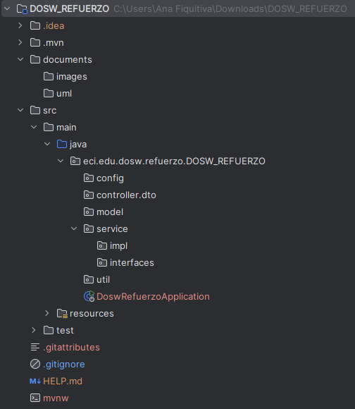

# DOSW_REFUERZO
#### Autor:
- Ana Gabriela Fiqutiva Poveda
---
### Enunciado:
- La empresa PetCare 360 quiere modernizar la manera en que las veterinarias gestionan sus servicios y la relación con
los clientes. Buscan una plataforma que permita:
1.  Registrar mascotas con sus características (raza, edad, historial médico).
2.	Agendar citas médicas y asignar veterinarios.
3.	Vender productos de cuidado animal (alimentos, medicamentos, accesorios).
4.  Generar facturación electrónica para cada servicio o compra.
- Su reto es diseñar, construir e implementar la primera versión del sistema, siguiendo buenas prácticas de ingeniería 
de software, aplicando patrones de diseño, principios SOLID, pruebas y diagramación.
---
# Desarrollo:
##  Tecnologías Utilizadas

- **Backend**: Spring Boot 
- **Gestión de Dependencias**: Maven
- **Pruebas**: JUnit 5
- **Cobertura**: JaCoCo
- **Calidad de Código**: SonarQube
- **Documentación API**: Swagger UI 

##  Instrucciones de Configuración y Desarrollo
1. Clonar el repositorio:
```bash
git clone https://github.com/AnaFiquitiva/DOSW_REFUERZO.git 
cd DOSW_REFUERZO
```
2. Ejecutar el proyecto:
```bash
mvn clean install
mvnw spring-boot:run
```
3. Acceder a la documentación de la API:

4. Ejecutar pruebas y cobertura:
```bash
mvn test
mvn jacoco:report
# Reporte en: target/site/jacoco/index.html
```
5. Análisis de calidad con SonarQube:
Configurar SonarQube y ejecutar análisis
```bash
mvn sonar:sonar
mvn sonar:sonar -Dsonar.login=TU_TOKEN
```
---
# Semana 1:
## 1. Scaffolding del Proyecto:
- Se realizó el scaffolding del proyecto con Spring Boot y gestión con Maven.



## 2. Dependencias:
- Se Agregaron las siguientes dependencias al archivo `pom.xml`:
1. JUNIT: Para pruebas unitarias.
    ```xml
    <!-- JUnit para pruebas unitarias -->
    <dependency>
        <groupId>org.junit.jupiter</groupId>
        <artifactId>junit-jupiter-engine</artifactId>
        <version>5.8.1</version>
        <scope>test</scope>
    </dependency>
    ```
2. JACOCO: Para medir la cobertura de pruebas.
    ```xml

    <!-- JaCoCo para cobertura de pruebas -->
    <dependency>
        <groupId>org.jacoco</groupId>
        <artifactId>jacoco-maven-plugin</artifactId>
        <version>0.8.10</version>
    </dependency>
    ```
3. SONARQUEBE: Para análisis de calidad de código.
    ```xml
    <!-- SonarQube -->
    <dependency>
        <groupId>org.sonarsource.scanner.maven</groupId>
        <artifactId>sonar-maven-plugin</artifactId>
        <version>3.9.1.2184</version>
    </dependency>
    ```
   4. LOMBOK: Para reducir el código boilerplate.
   ```xml
    <!-- Lombok -->
    <dependency>
        <groupId>org.projectlombok</groupId>
        <artifactId>lombok</artifactId>
        <optional>true</optional>
      </dependency>
   ```
5. SWAGGER UI: Para documentación de la API.
    ```xml
      <!-- Swagger UI -->
      <dependency>
        <groupId>org.springdoc</groupId>
        <artifactId>springdoc-openapi-starter-webmvc-ui</artifactId>
        <version>2.2.0</version>
      </dependency>
    ```
### 3. Estrategia de Ramas GITFLOW y Commits:
1. Definir la estrategia de ramas en Git:
- `main`: Código base.
- `develop`: Desarrollo del ejercicio.
- `feature/nombre`: Implementación de nuevas funcionalidades.
- `release/nombre`: Preparación para lanzamiento.
- `hotfix/nombre`: Corrección de errores .
2. Definir Commits:
- Feat: Nueva funcionalidad.
- Fix: Corrección de errores.
- Docs: Documentación.
- Style: Cambios de formato y estilo.
- Refactor: Refactorización de código.
- Test: Pruebas.

### 4. Diagramación Inicial:
- Crear diagramas UML iniciales:
1. Diagrama de Contexto.
2. Diagrama de Casos de Uso.
3. Diagrama de Clases Preliminar.

### 5. Funcionalidades Básicas:
- Implementar las siguientes funcionalidades básicas:
1. Registrar mascotas con sus características (raza, edad, historial médico).
2. Agendar citas médicas y asignar veterinarios.
3. Vender productos de cuidado animal (alimentos, medicamentos, accesorios).
4. Generar facturación electrónica para cada servicio o compra.

### Patrones de Diseño y Principios SOLID:
- Se aplicaron los siguientes patrones de diseño:

- Se aplicaron los principios SOLID en el diseño del sistema:
1. **S**ingle Responsibility Principle (SRP): Cada clase tiene una única responsabilidad.
2. **O**pen/Closed Principle (OCP): Las clases están abiertas para extensión pero cerradas para modificación.
3. **L**iskov Substitution Principle (LSP): Las clases derivadas pueden sustituir a sus clases base sin alterar el 
comportamiento del programa.
4. **I**nterface Segregation Principle (ISP): Las interfaces son específicas y no obligan a las clases a implementar 
métodos que no utilizan.
5. **D**ependency Inversion Principle (DIP): Las clases dependen de abstracciones y no de implementaciones concretas. 
